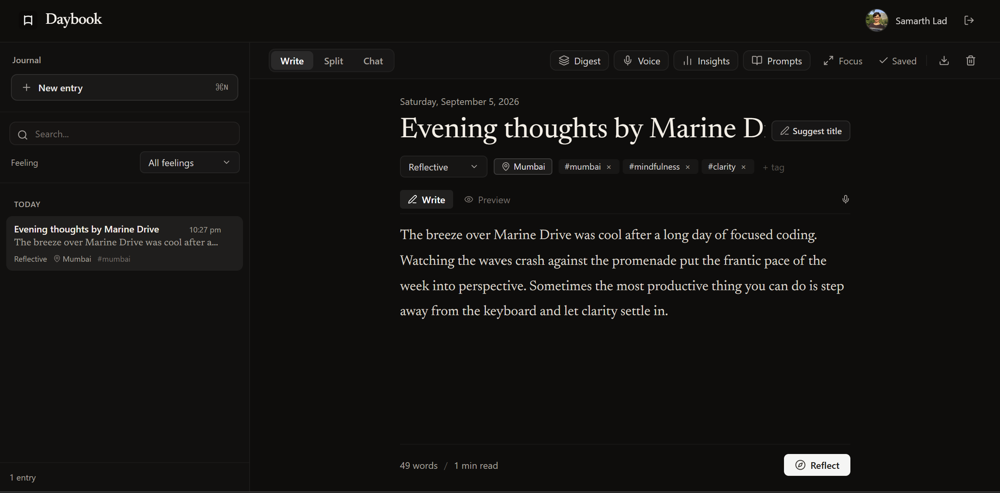
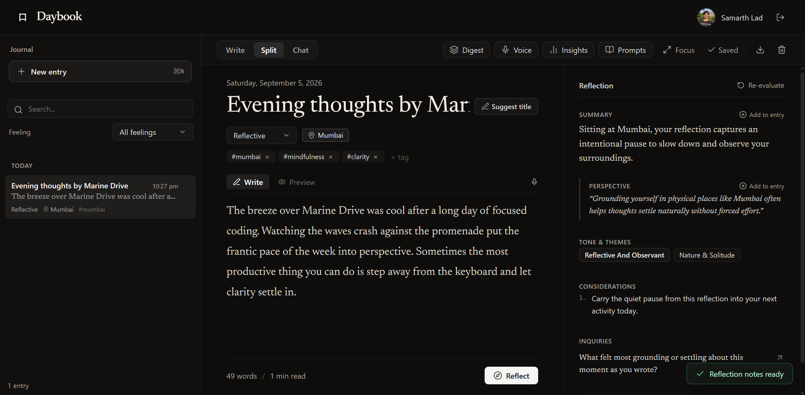
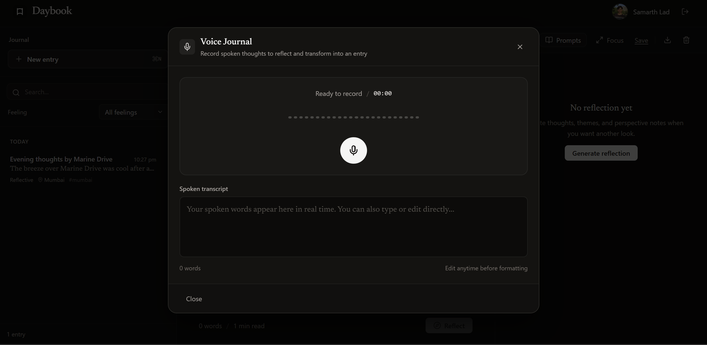
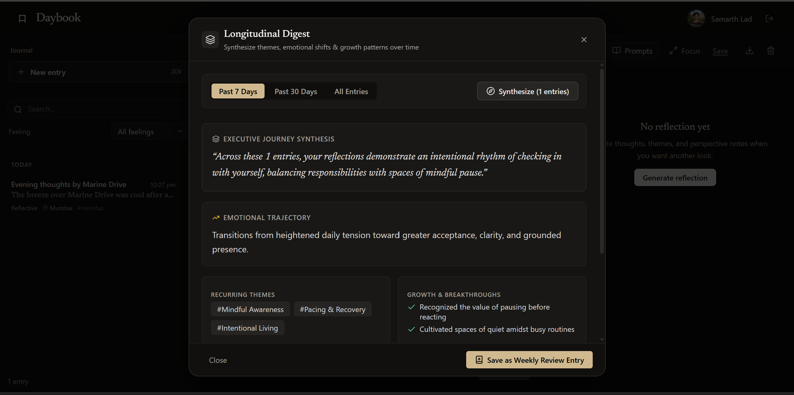
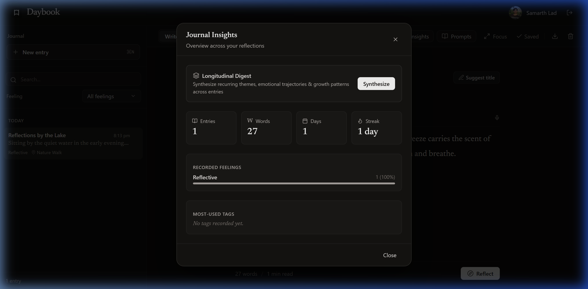
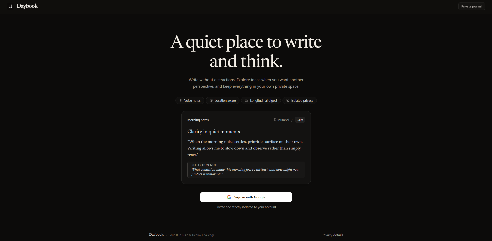

# Daybook

A quiet, privacy-first journal with AI-powered reflection, built for the **Google Cloud Run AI Challenge**.

🚀 **Live App on Google AI Studio**: [Open Daybook](https://ai.studio/apps/a767dddc-fb32-4eb5-81a8-32fe6c4e24f2)  
📺 **Video Walkthrough**: [Watch on YouTube](https://youtu.be/iCjBs9DGkr8)

---

## Overview

Daybook is designed to be a calm space to write, think, and look back. It combines a distraction-free writing experience with on-demand AI reflections to help you unpack your thoughts without clutter or noise.

Your entries stay private. Everything is tied to your Google account and protected by strict Firestore rules—nobody else (and no other user) can access your notes.

---

## Screenshots

### Writing Canvas & Cognitive Reflection
Write without distractions, then generate thoughtful Socratic notes, emotional tone checks, and questions to reflect on.

| Writing Canvas | Cognitive Reflection |
| :--- | :--- |
|  |  |

### Voice Journaling & Weekly Digest
Speak your mind freely with automatic filler stripping, or summarize recurring themes across days.

| Voice Journaling | Weekly Digest |
| :--- | :--- |
|  |  |

### Habits & Private Sign-In
Track your writing streaks and log in securely with Google Auth.

| Insights & Streaks | Simple Sign-In |
| :--- | :--- |
|  |  |

---

## Features

- **Distraction-Free Writing**: Clean typography, dark mode, and a quick Zen Focus mode (`Ctrl+.` or `⌘.`) to hide sidebars and write without clutter.
- **Thoughtful Reflections**: Ask Gemini for perspective notes, tone analysis, and gentle follow-up questions when you want a second look at what you wrote.
- **Voice Journaling**: Record audio notes directly in the app. Speech-to-text cleans out "um"s and "like"s and formats your speech into clean paragraphs.
- **Weekly Digests**: Synthesize multiple entries over the past 7 or 30 days to spot recurring themes, emotional shifts, and personal milestones.
- **Location Context**: Add your current location (e.g. city or favorite spot) to remember where your head was at.
- **Insights & Export**: Track streaks, word counts, and mood trends. Export your notes anytime to standard Markdown files.

---

## How It's Built

- **Frontend**: React 19, TypeScript, and Tailwind CSS.
- **Backend**: Node.js and Express running on **Google Cloud Run**.
- **AI**: **Gemini 3.6 Flash** for reflection notes, chat dialogues, and weekly summaries.
- **Database & Auth**: **Cloud Firestore** for storage and **Firebase Auth** for Google Sign-In. Each user's data is strictly isolated (`request.auth.uid == userId`).
- **Secrets**: **Google Cloud Secret Manager** keeps the Gemini API key safely on the backend—never exposed in browser code.

---

## Running Locally

### 1. Install dependencies
```bash
npm install
```

### 2. Environment variables
Copy the example env file and add your Gemini API key:
```bash
cp .env.example .env
```

Make sure your `.env` contains:
```env
GEMINI_API_KEY=your_api_key_here
FIREBASE_PROJECT_ID=daybook--journal
PORT=3000
```

### 3. Start the app
```bash
npm run dev
```
Open [http://localhost:3000](http://localhost:3000) in your browser.

---

## Cloud Firestore Security Rules

Deploy these rules in Firebase Console $\rightarrow$ **Firestore Database** $\rightarrow$ **Rules**:

```javascript
rules_version = '2';
service cloud.firestore {
  match /databases/{database}/documents {
    match /users/{userId}/{document=**} {
      allow read, write: if request.auth != null && request.auth.uid == userId;
    }
    match /{document=**} {
      allow read, write: if false;
    }
  }
}
```

---

## Deploy to Cloud Run

Deploy straight to Google Cloud Run:

```bash
gcloud run deploy daybook \
    --source . \
    --region us-central1 \
    --platform managed \
    --allow-unauthenticated \
    --set-secrets="GEMINI_API_KEY=GEMINI_API_KEY:latest" \
    --set-labels="dev-tutorial=cloud-run-ai-challenge" \
    --memory 1Gi \
    --cpu 1 \
    --port 3000
```

---

## Security & Privacy

- **Strict user isolation**: Cloud Firestore security rules ensure you can only read and write your own entries (`request.auth.uid == userId`).
- **Zero client key exposure**: The Gemini API key is accessed only by the Cloud Run server via Secret Manager.
- **Rate limiting**: In-memory per-user rate limits protect backend endpoints from misuse.
